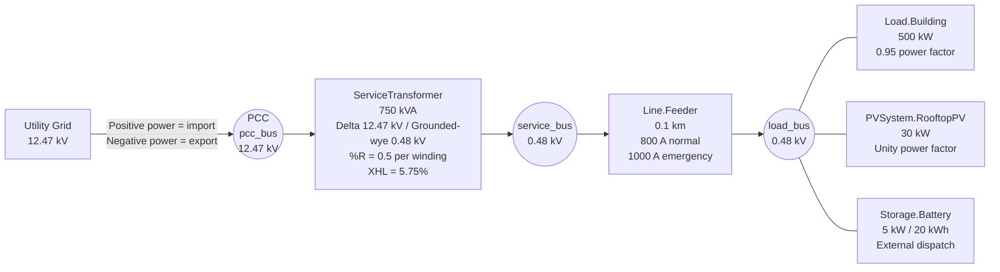

# Week 3 Microgrid One-Line Diagram

## Electrical Boundaries

The point of common coupling is `pcc_bus`, located between the
utility source and the primary winding of `ServiceTransformer`.

Power measured at transformer terminal 1 therefore represents
power exchanged with the utility grid:

- Positive real power means grid import.
- Negative real power means grid export and reverse power flow.

## Voltage Levels

- Utility and PCC: 12.47 kV line-to-line
- Transformer secondary: 0.48 kV line-to-line
- Service feeder and load bus: 0.48 kV line-to-line

OpenDSS voltage bases are defined for both 12.47 kV and 0.48 kV.

## Base-Case Results

- Solution converged: yes
- Load-bus voltage: approximately 0.9716 pu
- Transformer loading: approximately 72.21%
- Transformer real-power loss: approximately 3.91 kW
- PCC net grid import: approximately 506.46 kW
- Reverse power flow: no

## Modeling Assumptions

- The circuit is balanced and three-phase.
- The transformer primary is delta connected.
- The transformer secondary is grounded-wye connected.
- The building load uses a fixed 0.95 power factor.
- PV and storage are connected at the 0.48 kV load bus.
- PV and storage operate at unity power factor.
- The PCC sign convention is positive for import and negative for export.
